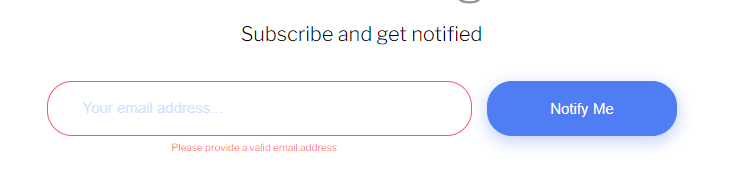

# Frontend Mentor - Ping coming soon page solution

This is a solution to the [Ping coming soon page challenge on Frontend Mentor](https://www.frontendmentor.io/challenges/ping-single-column-coming-soon-page-5cadd051fec04111f7b848da). Frontend Mentor challenges help you improve your coding skills by building realistic projects. 

## Table of contents

- [Overview](#overview)
  - [The challenge](#the-challenge)
  - [Screenshot](#screenshot)
  - [Links](#links)
- [My process](#my-process)
  - [Built with](#built-with)
  - [What I learned](#what-i-learned)
  - [Continued development](#continued-development)
- [Author](#author)

**Note: Delete this note and update the table of contents based on what sections you keep.**

## Overview

### The challenge

Users should be able to:

- View the optimal layout for the site depending on their device's screen size
- See hover states for all interactive elements on the page
- Submit their email address using an `input` field
- Receive an error message when the `form` is submitted if:
	- The `input` field is empty. The message for this error should say *"Whoops! It looks like you forgot to add your email"*
	- The email address is not formatted correctly (i.e. a correct email address should have this structure: `name@host.tld`). The message for this error should say *"Please provide a valid email address"*

### Screenshot


### Links

- Solution URL: [Add solution URL here](https://your-solution-url.com)
- Live Site URL: [Add live site URL here](https://your-live-site-url.com)

## My process

### Built with

- Semantic HTML5 markup
- CSS custom properties
- Sass
- Flexbox
- Mobile-first workflow
- [Vue.js](https://vuejs.org/) - JS library

### What I learned

I did my first aproach using a CSS preprocesor in this challenge. I chose Sass and used some of its features, such as **@mixin**, which work as functions in javascript, and the '&' parent selector to apply styles to pseudo-classes and pseudo-elements.

The site implements responsive web design using media querys 

```scss
@mixin formInput($color) {
    border: 1px solid $color;
    padding: $mobile-input-padding;
    margin: 5px;
}

.form__email {
    @include formInput($secondary-pale-blue);
    width: 100%;
    padding: 12px 35px;
    border-radius: 25px;
    &::placeholder {
        color: $secondary-pale-blue;
        opacity: .7;
    }
}

@media (min-width: 800px) {}
```
The form validation was performed with a simple validation using [Vue.js](https://vuejs.org/) Library.
This code and regular pattern is an adaptation of the form validation example found in the official library documentation



```js
(() => {
    const app = new Vue({
        el: '#app',
        data: {
            error: false,
            email: null
        },
        methods: {
            checkForm: function (e) {
                
                e.preventDefault();
                if (!this.email) {
                    this.error = true;
                } else if (!this.validEmail(this.email)) {
                    this.error = true;
                } else {
                    this.error = false;
                }
            },
            validEmail: function (email) {
                var re = /^(([^<>()\[\]\\.,;:\s@"]+(\.[^<>()\[\]\\.,;:\s@"]+)*)|(".+"))@((\[[0-9]{1,3}\.[0-9]{1,3}\.[0-9]{1,3}\.[0-9]{1,3}\])|(([a-zA-Z\-0-9]+\.)+[a-zA-Z]{2,}))$/;
                return re.test(email);
            }
        }
    })
})();
```

### Continued development

- Learn more about sass
- Learn new features of Vue.js such as reusability and components..

## Author

- Website - (not yet, working on content to show)
- Frontend Mentor - [@AbdielP](https://www.frontendmentor.io/profile/AbdielP)
- GitHub - [@AbdielP](https://github.com/AbdielP)
